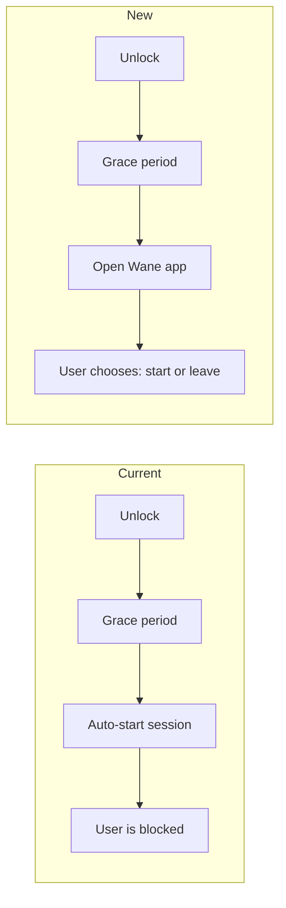

# Exit Phrase Display Fix + Focus on Unlock Behavior Change

## Issue 1: Exit Phrase Double Quotes and Case Sensitivity Hint

**Problem:** The exit phrase is displayed wrapped in double quotes (`"I am blessed"`), which may confuse users into thinking they need to type the quotes. Also, while the comparison is already case-insensitive in code, the UI doesn't tell the user this.

**Current code** in [SessionScreen.kt](app/src/main/kotlin/com/wane/app/ui/session/SessionScreen.kt) (line 266):
```kotlin
text = "\"$exitPhrase\""
```

**Current instruction** in [strings.xml](app/src/main/res/values/strings.xml) (line 51):
```xml
<string name="emergency_exit_instruction">Type the phrase below to end your session early</string>
```

### Changes

**A. Remove double quotes** from the phrase display in `SessionScreen.kt` line 266:
- Change `"\"$exitPhrase\""` to just `exitPhrase`
- The phrase is already styled distinctly (accent color, `bodyLarge`) so it's visually differentiated without quotes

**B. Add case-insensitivity hint** to `strings.xml`:
- Update `emergency_exit_instruction` to: `"Type the phrase below to end your session early. It\\'s not case-sensitive."`

---

## Issue 2: Focus on Unlock -- Open App Instead of Auto-Starting Session

**Problem:** Currently, `AutoLockScheduler` auto-starts a focus session after unlock + grace period. This traps the user -- they can't leave without typing the emergency exit phrase. The desired behavior is: just **open the Wane app** so the user can choose whether to start a session or leave.

**Current code** in [AutoLockScheduler.kt](app/src/main/kotlin/com/wane/app/service/AutoLockScheduler.kt) (line 128):
```kotlin
sessionManager.startSession(durationMs, "default")
```

### How it changes



Since no session is auto-started, `AppBlocker.shouldBlockApp()` returns `false` (it only blocks during `SessionState.Running`), so the user can freely leave the app. If they disable "Focus on Unlock" in settings during this state, they can still leave -- no session needs to be stopped.

### Changes

**A. Change `AutoLockScheduler` to open the app instead of starting a session:**
- Replace `sessionManager.startSession(durationMs, "default")` with an intent to bring `MainActivity` to the foreground (same pattern used in `AppBlocker.redirectToWane()`)
- Remove the duration-related checks (`durationMs <= 0L` guard) since we're no longer starting a session
- The `sessionManager` dependency can be kept for the `sessionState.value !is SessionState.Idle` check (still valid -- don't open the app if a session is already running)

**B. Remove `durationMinutes` from auto-lock settings** since it's no longer used:
- In [AutoLockSettingsScreen.kt](app/src/main/kotlin/com/wane/app/ui/settings/AutoLockSettingsScreen.kt): remove the Duration slider UI
- In [AutoLockViewModel.kt](app/src/main/kotlin/com/wane/app/ui/settings/AutoLockViewModel.kt): clean up duration-related state (optional -- dead code is harmless)
- Keep `durationMinutes` in `AutoLockConfig` data class to avoid a migration (DataStore field stays, just unused)

**C. Update string resources** in [strings.xml](app/src/main/res/values/strings.xml):
- `auto_lock_description` (line 32): Change from `"When enabled, a focus session starts quietly a few seconds after you unlock your phone — no need to open Wane."` to something like `"When enabled, Wane opens automatically a few seconds after you unlock your phone — ready for you to start a session."`
- `auto_lock_toggle_label` (line 33): Consider changing `"Start focus on unlock"` to `"Open Wane on unlock"` (or keep as-is if the existing label is preferred)

**D. Update tests** in [AutoLockSchedulerTest.kt](app/src/test/java/com/wane/app/service/AutoLockSchedulerTest.kt):
- The critical regression test (`onScreenUnlocked uses config durationMinutes not global default`) is no longer relevant since we don't start sessions
- Replace with a test verifying that `onScreenUnlocked` opens `MainActivity` (via an Intent on the mocked Context) instead of calling `sessionManager.startSession()`
- Keep tests for: disabled config is no-op, session already running is no-op, screen locked cancels grace, etc.

## Team of Agents Delegation

Following the Debug Mode workflow:

- **Frontend Developer**: Exit phrase display fix (SessionScreen.kt) + auto-lock settings Duration slider removal (AutoLockSettingsScreen.kt)
- **Backend Developer**: AutoLockScheduler behavior change (open app instead of start session)
- **Test Engineer**: Update AutoLockSchedulerTest to match new behavior
- **Content Writer**: Review and finalize updated string resources in strings.xml
- **Lead (orchestrator)**: Coordinate, verify, run build/lint/test
