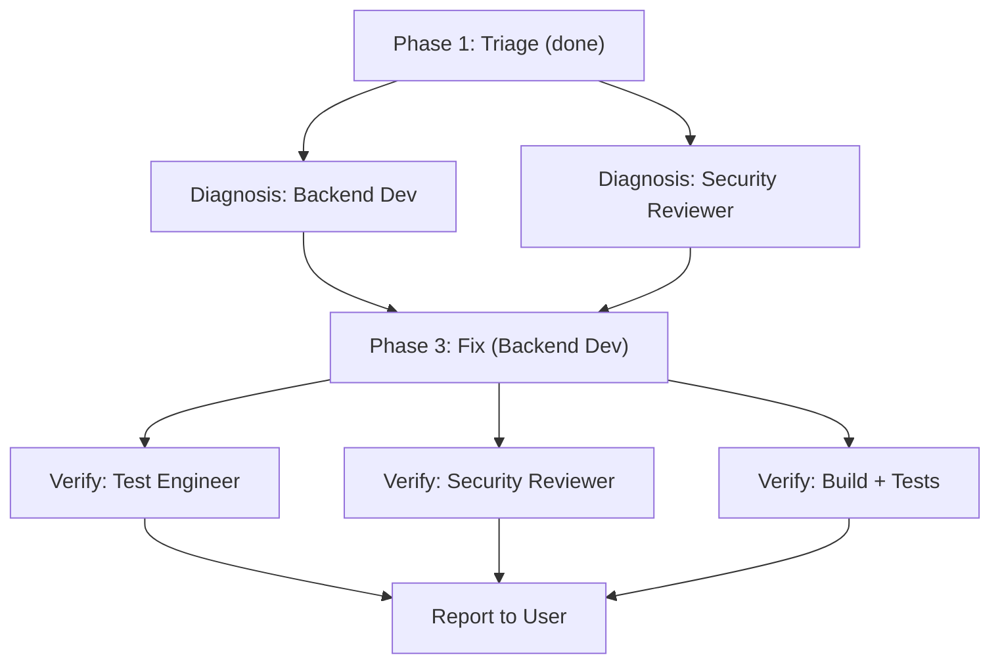

# Fix Notification Blocking and Full-Screen Intent Infinite Loop

This follows the **team-of-agents Debug Mode** workflow (Section 4 of the skill). No `.team/` directory setup is needed.

## Debug Phase 1: Triage (Complete)

Two problems identified from the user's report and codebase exploration:

### Problem A: Notifications not blocked during focus mode
- [WaneNotificationListener.kt](app/src/main/kotlin/com/wane/app/service/WaneNotificationListener.kt) only handles notifications posted AFTER a session starts (`onNotificationPosted`)
- Pre-existing notifications in the shade when a session begins are never snoozed
- The user expectation: only phone/SMS/emergency notifications visible; all others hidden during focus mode, then restored when focus ends

### Problem B: Full-screen notification infinite loop
- Apps like Samsung Calendar use `fullScreenIntent` to display full-screen event reminders
- [WaneAccessibilityService.kt](app/src/main/kotlin/com/wane/app/service/WaneAccessibilityService.kt) detects this as a `typeWindowStateChanged` event from a non-allowed package
- [AppBlocker.kt](app/src/main/kotlin/com/wane/app/service/AppBlocker.kt) calls `redirectToWane()` which launches `MainActivity`
- The Calendar full-screen intent immediately re-fires, causing Wane to redirect again -- infinite loop
- No debounce, cooldown, or rate-limiting exists in the redirect mechanism
- This is not Samsung Calendar specific -- any app with a `fullScreenIntent` (alarm apps, VoIP callers, medical alerts) could trigger the same issue

## Debug Phase 2: Diagnosis -- Specialist Spawning Plan

Spawn **two specialists in parallel** to diagnose both issues:

### Specialist 1: Backend Developer (Android services)
- **Goal**: Diagnose root causes and propose minimal fixes for both problems
- **Scope**: `WaneNotificationListener`, `AppBlocker`, `WaneAccessibilityService`, `EmergencySafety`, `PackageUtils`
- **Deliverable**: Root cause analysis with specific code-level diagnosis for each issue

### Specialist 2: Security Reviewer
- **Goal**: Review the proposed fix approach to ensure emergency access (calls, SMS, 911) is never compromised, and that the full-screen exemption cannot be exploited to bypass focus mode
- **Deliverable**: Safety assessment of the proposed changes

## Debug Phase 3: Fix -- Specialist Spawning Plan

Spawn **one Backend Developer** to implement the minimal, focused fix:

### Fix A: Complete notification blocking
Key files: [WaneNotificationListener.kt](app/src/main/kotlin/com/wane/app/service/WaneNotificationListener.kt)

- On session start (when `sessionState` transitions to `Running`), iterate `getActiveNotifications()` and snooze all non-allowed notifications already in the shade
- Ensure the existing `onNotificationPosted` path continues handling new notifications during the session
- Verify `unsnoozeAll()` correctly restores all hidden notifications when the session ends

### Fix B: Full-screen intent redirect loop prevention
Key files: [AppBlocker.kt](app/src/main/kotlin/com/wane/app/service/AppBlocker.kt), [WaneNotificationListener.kt](app/src/main/kotlin/com/wane/app/service/WaneNotificationListener.kt), [ServiceModule / EntryPoint](app/src/main/kotlin/com/wane/app/service/di/ServiceModule.kt)

**Design decision**: Full-screen intent notifications (calendar reminders, alarm clocks, VoIP calls, medical alerts) must NOT be blocked or cancelled. They are rare, intentional, and useful -- the user should see them even during focus mode. The problem to solve is purely the infinite redirect loop they cause.

Fix approach -- **detect full-screen intents in notification listener, exempt in app blocker**:
- In `WaneNotificationListener.onNotificationPosted()`, check `sbn.notification.fullScreenIntent != null`
- If true, skip snoozing that notification AND add `sbn.packageName` to a shared "full-screen exempt" set on `AppBlocker`
- In `AppBlocker.shouldBlockApp()`, check the exempt set and return `false` for any package currently in it
- In `WaneNotificationListener.onNotificationRemoved()`, if the removed notification had a full-screen intent, remove the package from the exempt set (so normal app blocking resumes)
- Wire the dependency: add `AppBlocker` to the `NotificationListenerEntryPoint` so `WaneNotificationListener` can call it
- This is deterministic (no timing heuristics), event-driven (exemption added/removed with the notification lifecycle), and generic (handles any app with `fullScreenIntent`)

## Debug Phase 4: Verify -- Specialist Spawning Plan

### Specialist 1: Test Engineer
- **Goal**: Update unit tests for `AppBlocker`, `WaneNotificationListener`, add new tests covering the full-screen exemption logic and pre-existing notification snoozing
- **Scope**: [AppBlockerTest.kt](app/src/test/java/com/wane/app/service/AppBlockerTest.kt), new test files as needed

### Specialist 2: Security Reviewer (peer verification)
- **Goal**: Fresh-eyes review of the implemented fix to verify emergency access is preserved and no regressions introduced
- **Scope**: All modified files

### Automated Verification
- Run the project's build and existing test suite to ensure no regressions

## Execution Order

## Key Constraints

- Fix must be minimal and focused -- no unrelated refactoring
- Emergency access (phone, SMS, 911, settings) must NEVER be blocked -- verified by Security Reviewer
- Full-screen intent notifications must NOT be blocked, cancelled, or snoozed -- they must be allowed to display
- The full-screen exemption is tied to the notification lifecycle: added when the notification is posted, removed when it is dismissed/removed
- Users cannot exploit this to bypass focus mode because only notifications with `fullScreenIntent` trigger the exemption, and these require special app permissions to post
- The fix must handle all full-screen intent scenarios generically, not just Samsung Calendar
